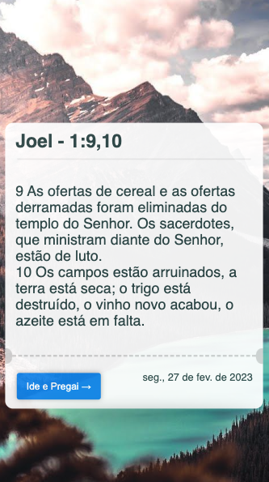

[](https://github.com/LucasSantosDev/bible-ticket/actions/workflows/static.yml)

# Bible Ticket

```Script que randomiza a geração de um screenshot de versículo(s) para edificar seu dia.```

<br />

> ### Versão de Computador

<br />


<br /><br />

> ### Versão de Celular

<br />



<br />

> ### Versão de Download

<br />

